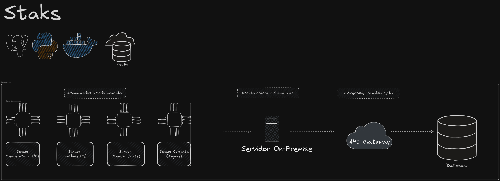

<style>
  .responsive-img {
    max-width: 100%;
    height: auto;
  }
</style>

# Exame Backend DtLabs 2025
## Layout





Este é um projeto backend para uma aplicação de IoT, desenvolvido em **Python** com **FastAPI** e **PostgreSQL**, como parte do desafio prático da empresa **DtLabs**.


## 📌 Pré-requisitos

Certifique-se de ter os seguintes requisitos instalados:

- [Docker](https://www.docker.com/)
- [Docker Compose](https://docs.docker.com/compose/)
- [Python 3.10+](https://www.python.org/)

---

## 🚀 Como executar

### 1️⃣ Clone e configure o repositório:
#### POWERSHELL
```Powershell
# caso não tenha permitido manupular o powershell na maquina

Set-ExecutionPolicy -ExecutionPolicy Unrestricted -Scope CurrentUser
```
```powershell
# Create the virtual environment
python -m venv .venv

# Activate the virtual environment
.venv\Scripts\activate
```

Run locally with the command:
```powershell
uvicorn app.main:app --host 0.0.0.0 --port 8000 --reload
```

<br><br>


#### bash

Configure the virtual environment
```bash
# Create the virtual environment
python -m venv .venv

# Activate the virtual environment
source .venv/bin/activate
```

Run locally with the command:
```bash
uvicorn app.main:app --host 0.0.0.0 --port 8000 --reload
```


Configurações do doker pendentes para execução. <br> compilação das atualizações pendentes.


# Tree
``` saída
|   .gitignore
|   docker-compose.yaml
|   Dockerfile
|   makefile
|   readMe.MD
|   requirements.txt
|   TODO.md
|   
+---.vscode
|       extensions.json
|       launch.json
|       
+---app
|   |   main.py
|   |
|   +---api
|   |       auth.py
|   |       __init__.py
|   |
|   +---db
|   |       database.py
|   |       security.py
|   |       __init__.py
|   |
|   +---models
|   |       model.py
|   |       session.py
|   |       __init__.py
|   |
|   \---router
|           sensor_data.py
|           server.py
|           __init__.py
|
+---modelos
\---test
        req.py
        test_model.py
```


``` Power Shell
tree /F /A | findstr /V ".venv"|   .env
```


```bash
tree /F /A | grep -v ".venv" | grep -v ".env"
```

